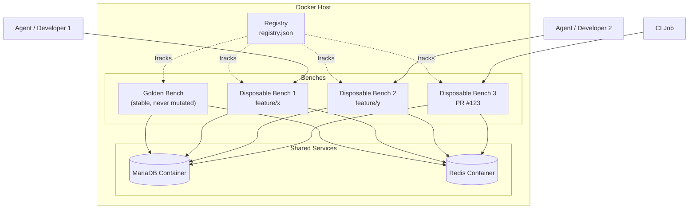
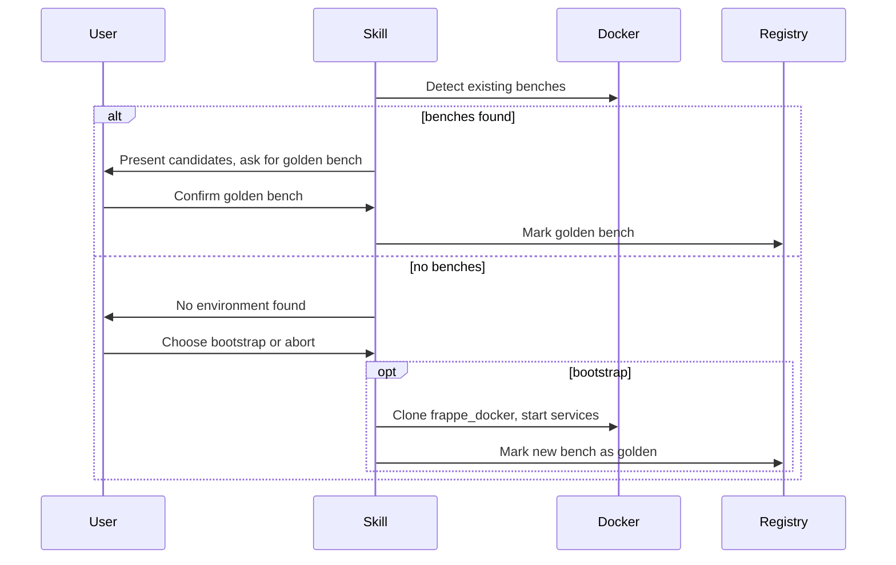

# Architecture

## Overview

The model separates **shared infrastructure** from **disposable benches**.



## Key components

### Golden bench

- Long-lived, stable, **never mutated**.
- Source of backups for restore-from-golden disposable benches.
- Protected by a hard-coded guard in every script.

### Disposable benches

- One per feature branch, worktree, or PR.
- Full independent `bench init` with its own `apps/`, `env/`, `sites/`.
- Short-lived; torn down after work is done.

### Shared MariaDB

- One container serves all benches.
- Each bench gets a dedicated database and database user.
- Prevents cross-bench data access by grants, not by container isolation.

### Shared Redis

- One container serves all benches.
- Each bench gets dedicated Redis DB indexes for cache, queue, and socketio.
- Never use `FLUSHALL`; always `FLUSHDB` on the specific index.

### Registry

- Single source of truth for every bench.
- Records name, path, site, ports, Redis DBs, DB user, branch, status, PID.
- Locked with `flock` during allocation to prevent races.

## Isolation boundaries

| Resource | Isolation mechanism |
|----------|---------------------|
| App code | Separate `apps/` directory per bench |
| Python env | Separate `env/` per bench |
| Database | Separate DB name + DB user per bench |
| Redis cache | Separate Redis DB index per bench |
| Redis queue | Separate Redis DB index per bench |
| Ports | Unique published port tuple per bench |
| Processes | One `bench start` per bench, tracked by PID |

## What is NOT isolated

- **MariaDB server resources** — a runaway query affects all benches.
- **Redis server resources** — memory and CPU are shared.
- **Queue semantics** — RQ workers can still consume jobs from another bench's queue DB if misconfigured. For strong job isolation, run a dedicated queue Redis per bench.
- **Network** — all benches can reach the shared services.

## First-run flow



## Port and Redis allocation

Ports are allocated from configurable bases:

```text
webserver_port = WEBSERVER_BASE_PORT + n
socketio_port  = SOCKETIO_BASE_PORT + n
file_watcher   = FILE_WATCHER_BASE_PORT + n
redis_db       = n
```

`n` is the smallest non-negative integer not already reserved in the registry.
